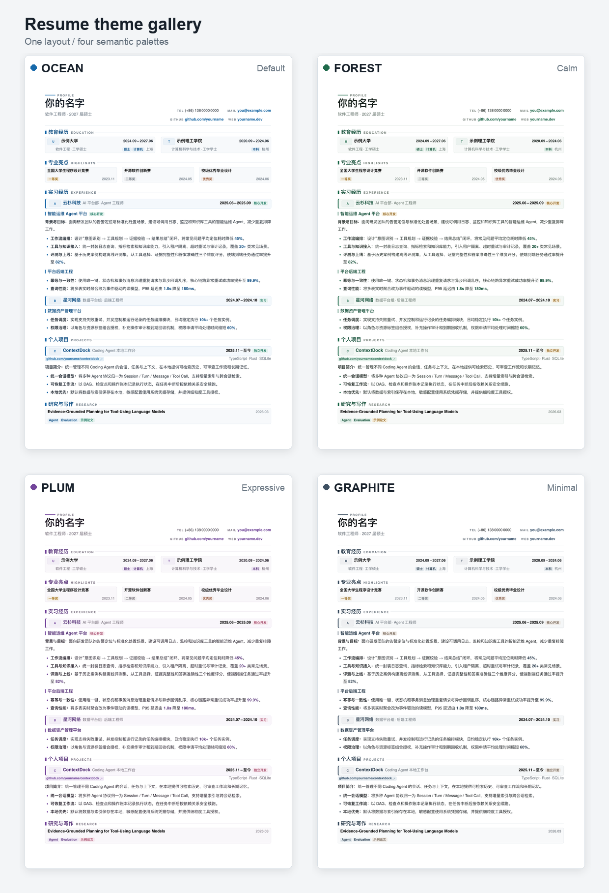

# 中文技术简历 LaTeX 模板

一份面向软件工程师与 AI / Agent 工程师的单页中文简历模板。内容、样式与主题色相互分离，支持 Overleaf 和本地 XeLaTeX；仓库自带隐私扫描、全主题构建与单页校验。

仓库中的姓名、学校、公司、经历、项目、链接和指标均为虚构示例，不对应真实个人或组织。

> **English summary:** A privacy-first, single-page Chinese résumé template for software and AI/agent engineers. It supports XeLaTeX, Overleaf, semantic color themes, reproducible multi-theme builds, and repository/history privacy checks.



## 特点

- 单页 A4 排版，针对中文技术简历的信息密度优化。
- `content.tex`、`theme.tex` 与版式命令分离，修改内容时不必碰样式。
- 内置 `ocean`、`forest`、`plum`、`graphite` 四套语义化主题色。
- 本地一次构建全部主题，自动确认每份 PDF 恰好一页，并拦截“不同主题渲染完全相同”的配置失效。
- 隐私检查覆盖手机号、非示例邮箱、内网链接、常见密钥、私钥、绝对用户目录、PNG 文本元数据、PDF 元数据和 Git 提交身份。
- 内置 AI-native `tailor-resume` Skill：先建立事实账本，再生成、脱敏、编译并逐页验收简历。
- CI 以最小权限运行隐私检查、测试和全主题编译。

## 快速开始

### Overleaf

1. 下载仓库源码或在 GitHub 中选择 **Download ZIP**。
2. 在 Overleaf 新建项目并上传源码，主文档选择 `resume.tex`。
3. 将编译器切换为 **XeLaTeX**。
4. 在 `content.tex` 中替换虚构示例。
5. 在 `resume.tex` 顶部修改 `\ResumeTheme` 选择主题。

Overleaf 不需要上传 `build/`、本地生成的 PDF 或任何包含真实信息的历史文件。

### 本地

依赖：

- TeX Live 2023 或更新版本；
- XeLaTeX；
- `pdfinfo` 与 `pdftoppm`（通常由 Poppler 提供）；
- Python 3.9 或更新版本。

macOS 可安装 MacTeX 与 Poppler；Debian / Ubuntu 可安装 `texlive-xetex`、`texlive-lang-chinese`、`texlive-latex-extra`、`fonts-noto-cjk` 和 `poppler-utils`。

```bash
make build
```

产物位于 `build/<theme>/resume-<theme>.pdf`。也可以只构建指定主题：

```bash
make build THEMES="ocean graphite"
```

若只想手动编译默认主题：

```bash
latexmk -xelatex -interaction=nonstopmode -halt-on-error resume.tex
```

## 修改内容

日常编辑只需修改 `content.tex`：

- 顶部是姓名、求职方向和联系方式；
- `\resumeheader` 创建姓名与联系信息网格；
- `\sectiontitle` 创建分区；
- `\eduentry`、`\awardcard` 创建教育与奖项卡片；
- `\cventry` 创建经历卡片；
- `\project` / `\projecttag` 创建项目标题；
- `\lead` 与 `\metric` 突出职责和量化结果。

示例中的数字只是排版占位。替换为真实数据前，应确认数据可公开、可解释，且不受保密协议或组织政策限制。

## 主题与颜色定制

在 `resume.tex` 顶部选择内置主题：

```tex
\providecommand{\ResumeTheme}{forest}
```

所有颜色都集中在 `theme.tex`，正文只使用语义颜色：

| Token | 用途 |
| --- | --- |
| `Accent` / `AccentStrong` | 分区标题、强调线与关键指标 |
| `AccentSoft` / `AccentSurface` | 标签与经历卡片浅色背景 |
| `Secondary` / `SecondarySoft` | 角色与职责标签 |
| `Ink` | 主文本 |
| `Muted` / `Subtle` | 次要文本与英文小标题 |
| `Rule` | 分隔线 |
| `Surface` / `SurfaceStrong` / `Paper` | 卡片与页面背景 |
| `Link` | 链接文本 |

新增主题时，复制一个现有的 `\Use...Theme` 配置、覆盖全部语义 token，再把主题加入 `\ifdefstring` 分派和 `Makefile` 的 `THEMES`。请保证正文与背景有足够对比度，然后运行 `make build` 检查所有主题。

也可以从命令行临时选择主题，不改源码：

```bash
latexmk -xelatex \
  -usepretex='\def\ResumeTheme{forest}' \
  resume.tex
```

## AI-native Skill

仓库内置 [`tailor-resume`](skills/tailor-resume/SKILL.md) Skill，适合以下任务：

- 把经历笔记、旧简历或面试素材整理成 `content.tex`；
- 基于证据生成量化表述，不虚构公司、日期、指标或成果；
- 将原始材料隔离在 Git 仓库之外，并在公开前执行 denylist 隐私审计；
- 编译指定或全部主题，检查页数、缺字、溢出与重复渲染；
- 把 PDF 逐页渲染为 PNG，完成真正的视觉 QA。

安装到 Codex：

```bash
mkdir -p ~/.codex/skills
cp -R skills/tailor-resume ~/.codex/skills/
```

示例：

```text
用 $tailor-resume 把这些经历素材整理成一页中文后端简历，
先建立事实账本，不确定的内容不要猜，最后用 forest 主题渲染验收。
```

## 隐私检查

公开前先运行：

```bash
make privacy
make privacy-history
```

`make privacy` 检查当前仓库文件；`make privacy-history` 还会检查从 `HEAD` 可达的提交身份和历史 blob。扫描器不会输出命中的原文，只报告文件、行号与规则。

检查项包括：

- 中国大陆手机号样式（保留明显的全零示例号）；
- RFC 保留域之外的邮箱；
- 私网、回环、本地域名和带凭据 URL；
- 常见平台 token、JWT、云访问密钥、私钥头和疑似高熵凭据赋值；
- `/Users/<name>`、`/home/<name>` 等本机用户名路径；
- 未批准的二进制文件、被提交的生成 PDF；
- 显式允许的 PNG 是否具有正确签名、合法 chunk/CRC，且不含文本或 EXIF chunk；
- PDF 中的作者、邮箱、链接、用户路径等元数据；
- Git author / committer 的非隐私邮箱，以及历史中已删除但仍可达的敏感内容。

扫描器是防呆工具，不可能判断某个姓名、公司名、项目名或业务数字是否真实。最终发布仍需人工逐字审阅。

## 从私人简历发布为公开仓库

不要直接把私人简历仓库改名后公开，也不要把旧仓库 `push --mirror` 到公开远端。推荐流程：

1. 复制模板文件到一个全新的目录或创建只有一个干净根提交的发布分支。
2. 将所有内容替换为虚构示例，并删除生成文件、图片 EXIF、附件和编辑器缓存。
3. 使用 GitHub 的隐私邮箱或专用公开身份创建提交。
4. 运行 `make ci`，确认当前文件、完整可达历史和全部主题均通过。
5. 用无痕窗口检查 GitHub 的提交、作者、Issue、Actions 日志和 Release 附件。

更完整的逐项清单见 [公开发布清单](docs/PRIVACY.md)。

## 目录结构

```text
.
├── content.tex                 # 虚构示例内容；使用者主要编辑此文件
├── resume.tex                  # 文档入口与排版命令
├── theme.tex                   # 语义颜色与主题
├── assets/previews/            # 已清除元数据的主题预览
├── scripts/
│   ├── build_themes.sh         # 构建主题，验证单页与主题差异
│   └── privacy_check.py        # 文件、图片、历史与 PDF 隐私扫描
├── skills/tailor-resume/       # AI-native 简历生成与验收 Skill
├── tests/                      # 仓库隐私扫描器回归测试
├── .github/workflows/ci.yml    # GitHub Actions
└── docs/PRIVACY.md             # 发布前隐私清单
```

## 开发

```bash
make test              # 仓库扫描器 + Skill 脚本单元测试
make privacy-history   # 当前文件 + 可达 Git 历史
make build             # 全主题 XeLaTeX + 单页校验
make ci                # 与 CI 等价的完整检查
```

贡献前请阅读 [CONTRIBUTING.md](CONTRIBUTING.md)。安全问题请按 [SECURITY.md](SECURITY.md) 私下报告。

## 许可证

[MIT License](LICENSE)
